# 🔄 **Data Pipeline Documentation**

## **📊 Complete Data Flow Architecture**

### **🎯 High-Level Data Pipeline**

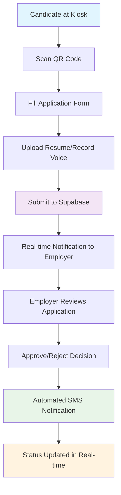

---

## **🏗️ Detailed Technical Data Pipeline**

### **1. Data Ingestion Layer**

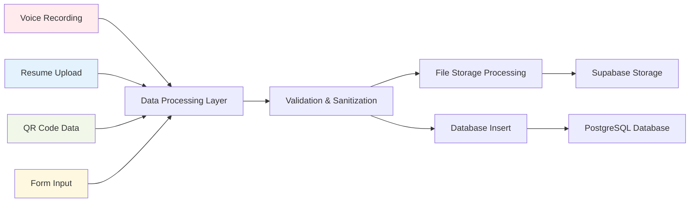

### **2. Storage & Processing Pipeline**

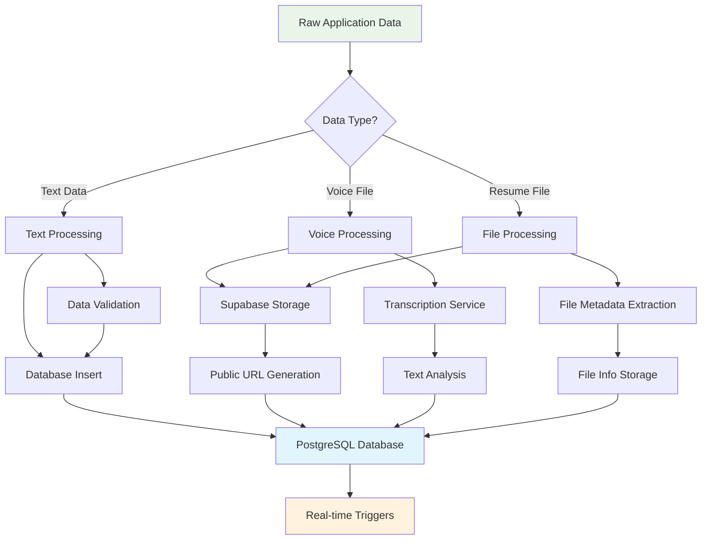

### **3. Real-time Data Flow**

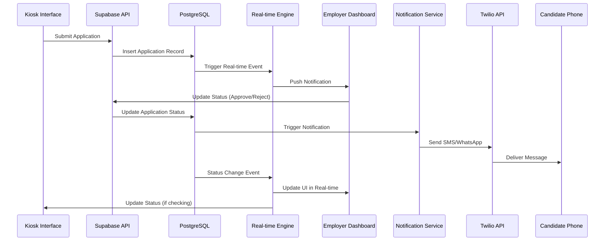

---

## **💾 Database Data Pipeline**

### **4. Database Schema Flow**

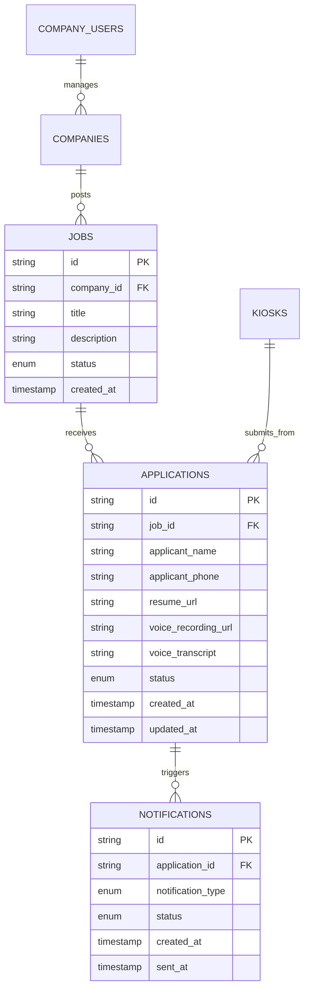

---

## **🔄 Data Processing Workflows**

### **5. Application Submission Pipeline**

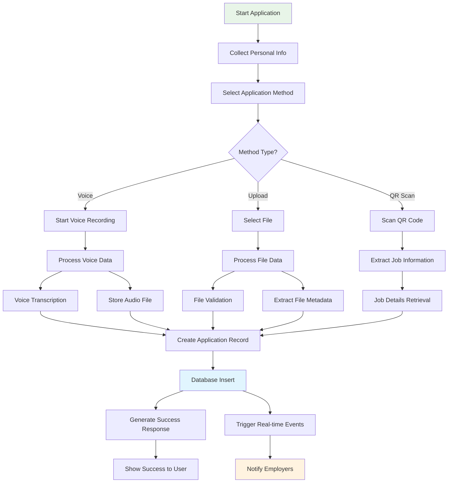

### **6. Notification Processing Pipeline**

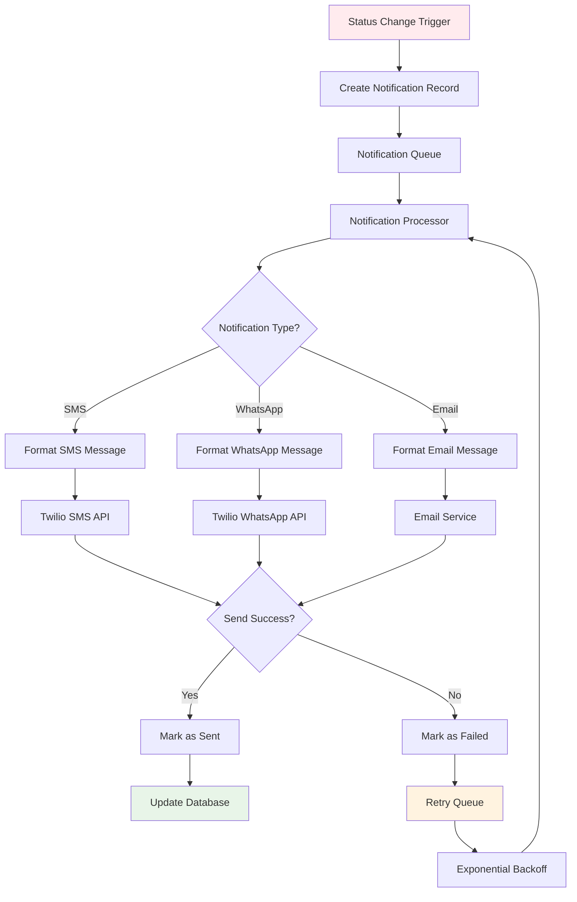

---

## **📡 API Data Flow**

### **7. RESTful API Pipeline**

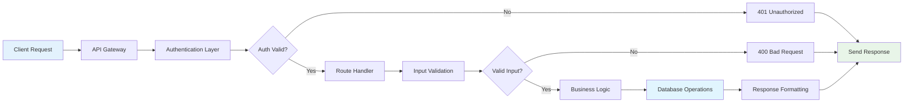

### **8. File Upload Pipeline**

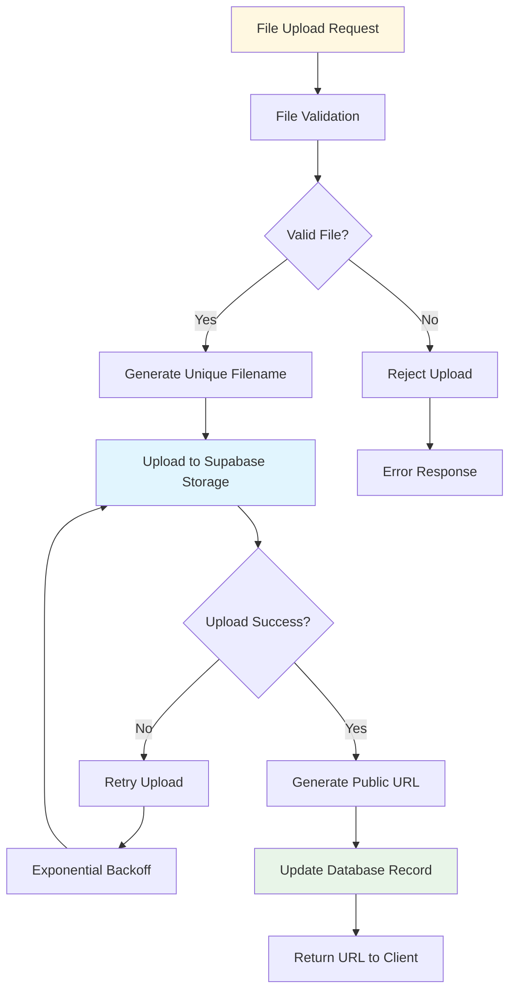

---

## **⚡ Real-time Data Synchronization**

### **9. WebSocket Data Pipeline**

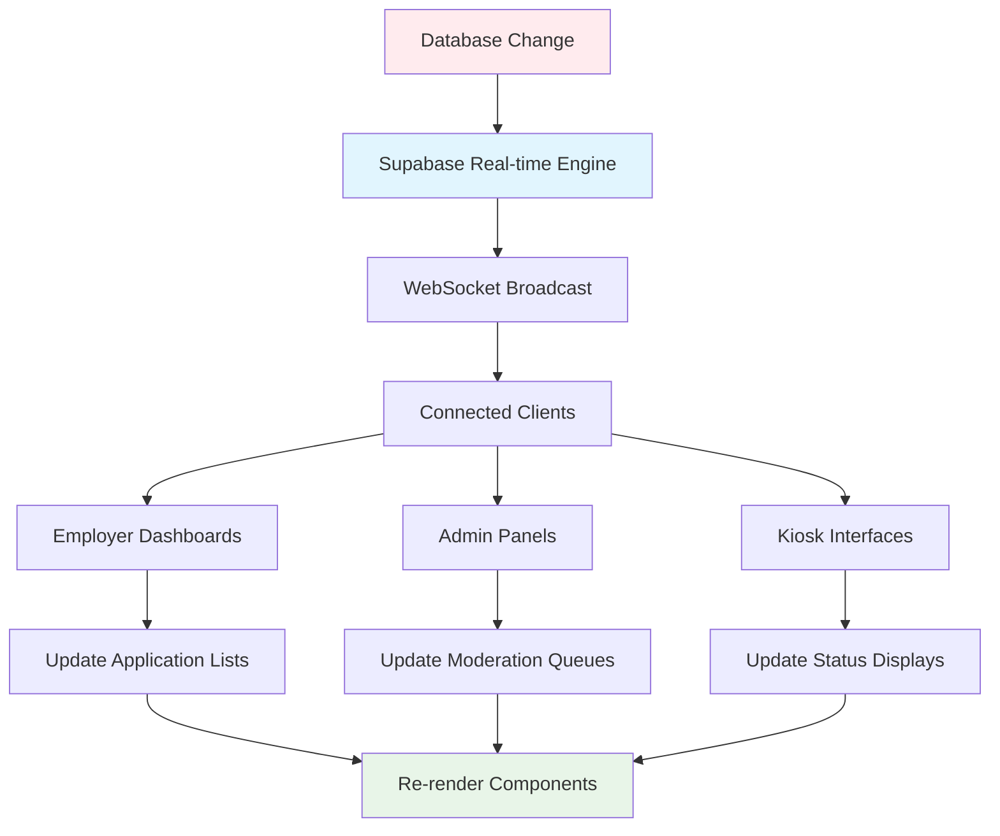

---

## **🔍 Data Monitoring & Analytics**

### **10. Analytics Data Pipeline**

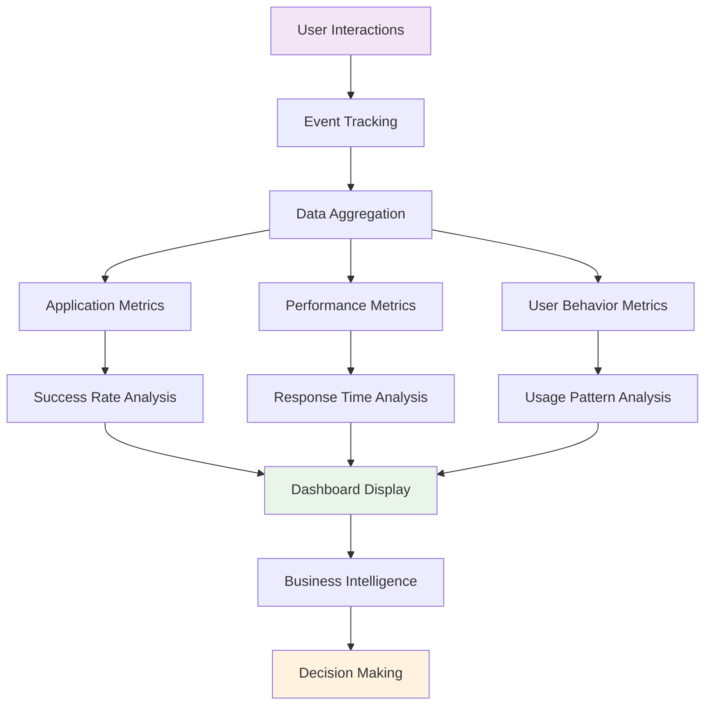

---

## **📊 Data Models & Structures**

### **Application Data Structure**
```json
{
  "id": "uuid",
  "job_id": "uuid",
  "applicant_name": "string",
  "applicant_phone": "string", 
  "applicant_email": "string|null",
  "application_method": "kiosk_qr|kiosk_voice|online",
  "resume_url": "string|null",
  "voice_recording_url": "string|null",
  "voice_transcript": "string|null",
  "status": "submitted|under_review|approved|rejected",
  "ai_score": "number|null",
  "created_at": "timestamp",
  "updated_at": "timestamp"
}
```

### **Notification Data Structure**
```json
{
  "id": "uuid",
  "application_id": "uuid",
  "notification_type": "application_received|status_update|interview_scheduled",
  "recipient_phone": "string",
  "message_content": "string",
  "status": "pending|sent|failed|delivered",
  "twilio_sid": "string|null",
  "sent_at": "timestamp|null",
  "delivered_at": "timestamp|null",
  "created_at": "timestamp"
}
```

---

## **🚀 Performance Optimization**

### **Data Pipeline Optimizations**
1. **Connection Pooling** - Efficient database connections
2. **Caching Strategy** - Redis for frequently accessed data
3. **Batch Processing** - Group notifications for efficiency
4. **Async Operations** - Non-blocking file uploads
5. **Database Indexing** - Optimized query performance
6. **CDN Integration** - Fast file delivery

### **Monitoring & Alerts**
- **Real-time Metrics** - Application performance
- **Error Tracking** - Failed operations
- **Usage Analytics** - User behavior patterns
- **System Health** - Resource utilization

This comprehensive data pipeline ensures **scalable**, **reliable**, and **real-time** processing of all job application workflows! 🎯